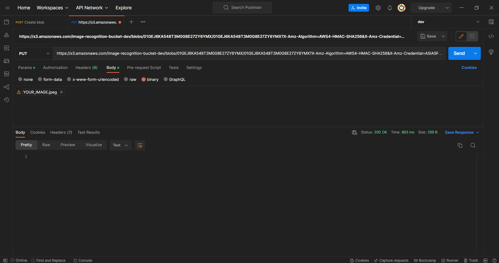
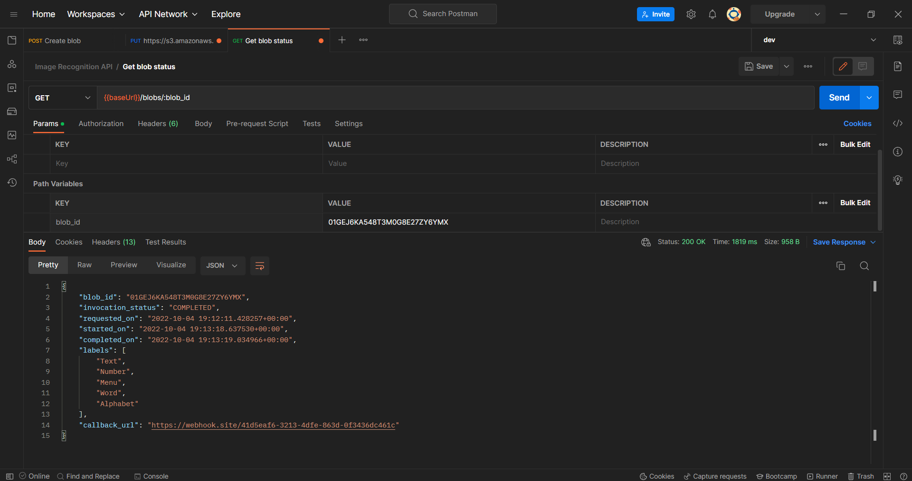

# Serverless Image Recognition v2⚡🔎 
A simple API for the images recognition using AWS Rekognition on the back-end. Using the Serverless framework for describing infrastructure.
[](http://www.serverless.com)  [](https://www.python.org/) [](https://github.com/kfrawee/) 

## **Overview:**
A simple API for the recognition of images using AWS Rekognition on the back-end. The API stores an image, does image recognition and labeling on it and returns results to the user in two ways, with a provided `callback` or a using `GET /blobs/{blob_id}` endpoint.

<br><b>This is an updated version from [image-recognition-api](https://github.com/kfrawee/image-recognition-api)</b>:
- Applying code best practice.
- Applying better project structure.
- Applying better logging and error handling.

<br>
<p align="center">
<br>
<b>Architecture diagram</b>
</p>

---
## **Usage:**
- Clone the repository:
    ```sh
    $ git clone https://github.com/kfrawee/serverless-image-recognition.git
    ```

- Navigate to the directory:
    ```sh
    $ cd .\serverless-image-recognition\
    ```
> This project uses [`serverless`](https://www.serverless.com/) framework ⚡. So, make sure you get that first and give the necessary permissions to `serverless cli`. Follow [this page](https://www.serverless.com/framework/docs/getting-started/) for getting started. <br>

- Deploy the stack:
    ```sh
    $ serverless deploy

    ✔ Service deployed to stack image-recognition-dev
    ```
- After deployment is successful, you can check the deployed stack details using:
    ```sh
    $ serverless info

    service: image-recognition
    stage: dev
    region: us-east-1
    stack: image-recognition-dev
    endpoints:
    POST - https://***.execute-api.us-east-1.amazonaws.com/dev/blobs
    GET - https://***.execute-api.us-east-1.amazonaws.com/dev/blobs/{blob_id}
    functions:
    createBlob: image-recognition-dev-createBlob
    getBlob: image-recognition-dev-getBlob
    labelImage: image-recognition-dev-labelImage
    callback: image-recognition-dev-callback
    layers:
    pyimage: arn:aws:lambda:us-east-1:***:layer:pyimage:42
  ```
## **Workflow:**
1- Send a `POST` request to Create blob endpoint `POST /blobs` to get a `blob_id` and a pre-signed url to upload your image:
> - *You can use `cURL` to send requests or you can use [Postman](https://www.postman.com/) or [REQBIN](reqbin.com).*
> - *You can use [webhook.site](https://webhook.site/) to get a callback url to receive status updates.*
- Request: 
    - cURL:
        ```sh
        curl --location --request POST 'https://***.execute-api.us-east-1.amazonaws.com/dev/blobs' \
        --header 'Content-Type: application/json' \
        --data-raw '{
            "callback_url": "https://webhook.site/41d5eaf6-3213-4dfe-863d-0f3436dc461c"
        }'
        ```
    - Postman:
        <br>
        <p align="center">
        <br>
        <b>Create blob</b>
        </p>
- Response:
    ```json
    {
        "blob_id": "01GEJ202KZ7PEBZ36X401352AE",
        "invocation_status": "ACTION_REQUIRED",
        "requested_on": "2022-10-04 17:51:46.815566+00:00",
        "upload_url": "https://s3.amazonaws.com/image-recognition-bucket-dev/blobs/01GEJ202KZ7PEBZ36X401352AE/01GEJ202KZ7PEBZ36X401352AE?X-Amz-Algorithm=AWS4-HMAC-SHA256&X-Amz-Credential=...",
        "callback_url": "https://webhook.site/41d5eaf6-3213-4dfe-863d-0f3436dc461c",
        "_links": {
            "status": "https://siw4d3y44i.execute-api.us-east-1.amazonaws.com/dev/blobs/01GEJ202KZ7PEBZ36X401352AE"
        }
    }
    ```
    - Use the **`upload_url`** to upload your image.
    - Use the **`blob_id`** to retrieve status from `GET /blobs/{blob_id}`
    - Also, you will recieve status update on the `callback_url` - *if provided*.

2- Upload your image:

- cURL:
    ```sh
    curl --location --request PUT 'https://s3.amazonaws.com/image-recognition-bucket-dev/blobs/01GEJ202KZ7PEBZ36X401352AE/01GEJ202KZ7PEBZ36X401352AE?X-Amz-Algorithm=AWS4-HMAC-SHA256&X-Amz-Credential=...' \
    --header 'Content-Type: image/jpeg' \
    --data-binary '@/PATH/TO/YOUR/IMAGE/test1.jpeg'
    ```
- Postman:
    <br>
    <p align="center">
    <br>
    <b>Upload image</b>
    </p>

3- Retrieve Status:

- Request:
    - cURL:
        ```sh
        curl --location --request GET 'https://siw4d3y44i.execute-api.us-east-1.amazonaws.com/dev/blobs/01GEJ202KZ7PEBZ36X401352AE'
        ```
    - Postman:
        <br>
        <p align="center">
        <br>
        <b>Retrieve status</b>
        </p>
Response:
```json
{
    "blob_id": "01GEJ202KZ7PEBZ36X401352AE",
    "invocation_status": "COMPLETED",
    "requested_on": "2022-10-04 17:51:46.815566+00:00",
    "started_on": "2022-10-04 17:53:14.793551+00:00",
    "completed_on": "2022-10-04 17:53:15.236018+00:00",
    "labels": [
        "Car",
        "Sports Car",
        "Coupe",
        "Tire",
        "Wheel"
    ],
    "callback_url": "https://webhook.site/41d5eaf6-3213-4dfe-863d-0f3436dc461c"
}
```

## **Cleaning:**
To remove all the services and resources:

```sh
$ serverless remove

✔ Service image-recognition has been successfully removed
```